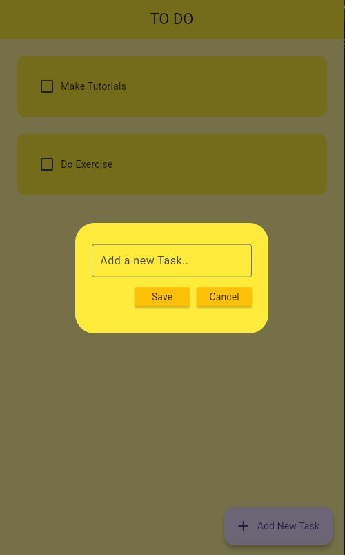
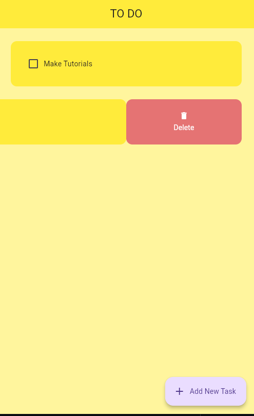

# TO DO App

A simple Flutter To-Do application that uses [Hive](https://docs.hivedb.dev/) as a local NoSQL database for persistent storage.

## Features

- Add, delete, and mark tasks as completed
- Persistent storage using Hive (no internet required)
- Clean and simple Material UI

## Screenshots

Below are some screenshots of the app in action:

### Homepage


*The homepage displays your current to-do list and allows you to manage your tasks easily.*

### Add To-Do



*Quickly add new tasks to your list using the add button.*

### Delete To-Do



*Remove completed or unwanted tasks with a simple delete action.*

## Getting Started

### Prerequisites

- [Flutter](https://flutter.dev/docs/get-started/install) SDK
- Dart
- A device or emulator

### Installation

1. **Clone the repository:**

   ```sh
   git clone <your-repo-url>
   cd todo
   ```

2. **Install dependencies:**

   ```sh
   flutter pub get
   ```

3. **Run the app:**
   ```sh
   flutter run
   ```

## Project Structure

- `lib/main.dart`: App entry point, initializes Hive and launches the app.
- `lib/todo_page.dart`: Main UI for displaying and managing tasks.
- `lib/db/db.dart`: Handles all database operations using Hive.
- `lib/utils`: Contains UI components like dialog boxes and to-do tiles.

## Hive Database

- The app uses a Hive box named `todos` to store the to-do list.
- Tasks are stored as a list of `[String, bool]` where the string is the task description and the boolean is the completion status.

## Dependencies

- [flutter](https://pub.dev/packages/flutter)
- [hive](https://pub.dev/packages/hive)
- [hive_flutter](https://pub.dev/packages/hive_flutter)

## Example: main.dart

```dart
import 'package:flutter/material.dart';
import 'package:hive_flutter/hive_flutter.dart';
import 'package:todo/todo_page.dart';

void main() async {
  // Initialize Hive
  await Hive.initFlutter();

  // Create Database
  var todos = await Hive.openBox('todos');

  runApp(const MyApp());
}

class MyApp extends StatelessWidget {
  const MyApp({super.key});

  // This widget is the root of your application.
  @override
  Widget build(BuildContext context) {
    return MaterialApp(
      debugShowCheckedModeBanner: false,
      title: 'TO DO APP',
      home: const TODO(),
      theme: ThemeData(primaryColor: Colors.yellow),
    );
  }
}
```

## License

MIT License

---

Feel free to contribute or open issues for improvements!

git commit -m "first commit"
git branch -M main
git remote add origin git@github.com:zigahchristian/flutter_Todo_App.git
git push -u origin main
